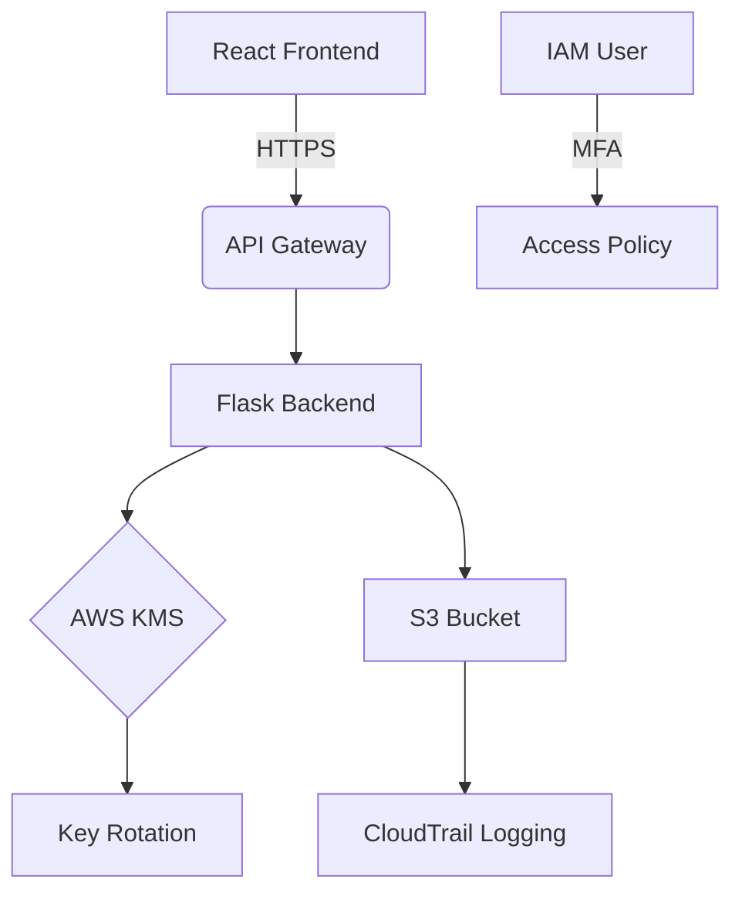

\# 🔒 Secure Cloud File Vault 
**GDPR/HIPAA-Compliant Encrypted Storage | AWS + Terraform + Python**

[](https://www.terraform.io/)
[](https://python.org)
[](https://aws.amazon.com)
[](https://react.dev)

A production-grade encrypted file storage system implementing zero-trust security principles for cloud environments. Designed to meet enterprise compliance requirements (GDPR, HIPAA, SOC 2).

👉 **Live Demo**: [https://secure-vault-demo.com](https://secure-vault-demo.com)  
📁 **AWS Architecture Diagram**: [ARCHITECTURE.md](docs/ARCHITECTURE.md)


## 🛡️ Key Security Features
| Feature                  | Implementation Details                          | Compliance Standard       |
|--------------------------|-------------------------------------------------|---------------------------|
| **End-to-End Encryption**| AWS KMS (AES-256) + Client-Side Encryption      | NIST SP 800-57            |
| **MFA Access Control**   | IAM Policies with `aws:MultiFactorAuthPresent`  | CIS AWS Foundation v2.0   |
| **Audit Trail**          | CloudTrail + S3 Access Logs                     | GDPR Art. 30              |
| **Versioning**           | S3 Object Lock & Versioning                     | SEC 17a-4(f)              |
| **Vulnerability Scans**  | Trivy Container Scans + ScoutSuite              | OWASP Top 10              |

## 📦 Architecture


## 🚀 Quick Start

### Prerequisites
- AWS Account (Free Tier OK)
- Terraform v1.5+
- Python 3.10+

### Installation
1. **Clone Repository**
   ```bash
   git clone https://github.com/FawazMalik-jjj/secure-file-vault
   cd secure-file-vault
   ```

2. **Initialize Terraform**
   ```bash
   cd infrastructure
   terraform init
   ```

3. **Deploy Cloud Resources**
   ```bash
   terraform apply -var="aws_region=us-east-1"
   ```

4. **Start Backend Server**
   ```bash
   cd ../backend
   pip install -r requirements.txt
   export S3_BUCKET=$(terraform output -raw s3_bucket_name)
   export KMS_KEY_ARN=$(terraform output -raw kms_key_arn)
   flask run --port 5000
   ```

5. **Run React Frontend**
   ```bash
   cd ../frontend
   npm install
   npm start
   ```

## 🔐 Usage Examples

### Upload File (cURL)
```bash
curl -X POST -H "X-User-ID: alice123" -F "file=@secret.doc" \
https://api.example.com/upload
```

### Download File (Python SDK)
```python
import boto3
s3 = boto3.client('s3', region_name='us-east-1')
url = s3.generate_presigned_url(
    'get_object',
    Params={'Bucket': 'secure-vault', 'Key': 'alice123/secret.doc'},
    ExpiresIn=3600
)
```

### Audit Log Search
```bash
aws cloudtrail lookup-events \
--lookup-attributes AttributeKey=EventName,AttributeValue=DeleteObject \
--start-time "2024-01-01" --end-time "2024-12-31"
```

## 📜 Compliance Documentation
This solution implements:
- **GDPR** Article 32 (Encryption & Access Control)
- **HIPAA** 164.312(e)(2)(ii) (Audit Controls)
- **AWS Well-Architected Framework** Security Pillar

Validation Tools:
```bash
# CIS Benchmark Check
scoutsuite aws --report-dir ./scout-reports

# Vulnerability Scan
trivy config --severity HIGH,CRITICAL ./infrastructure/
```

## 🤝 Contributing
1. Fork the repository
2. Create your feature branch (`git checkout -b feature/amazing-feature`)
3. Commit changes (`git commit -m 'Add some amazing feature'`)
4. Push to branch (`git push origin feature/amazing-feature`)
5. Open a Pull Request

[](CODE_OF_CONDUCT.md)

## 📄 License
MIT License - see [LICENSE](LICENSE) for details

## 📧 Contact
**Your Name**  
[](https://linkedin.com/in/fawaz-i-malik)  
fawazmalik@proton.me